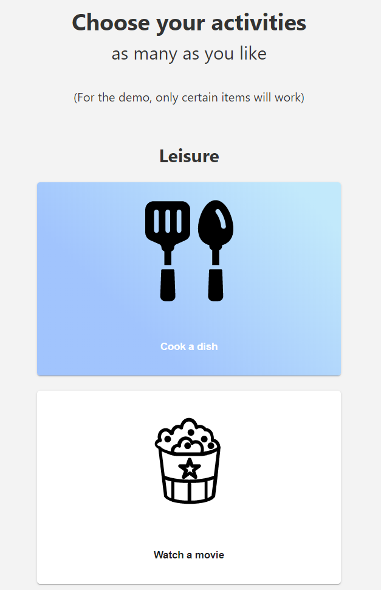
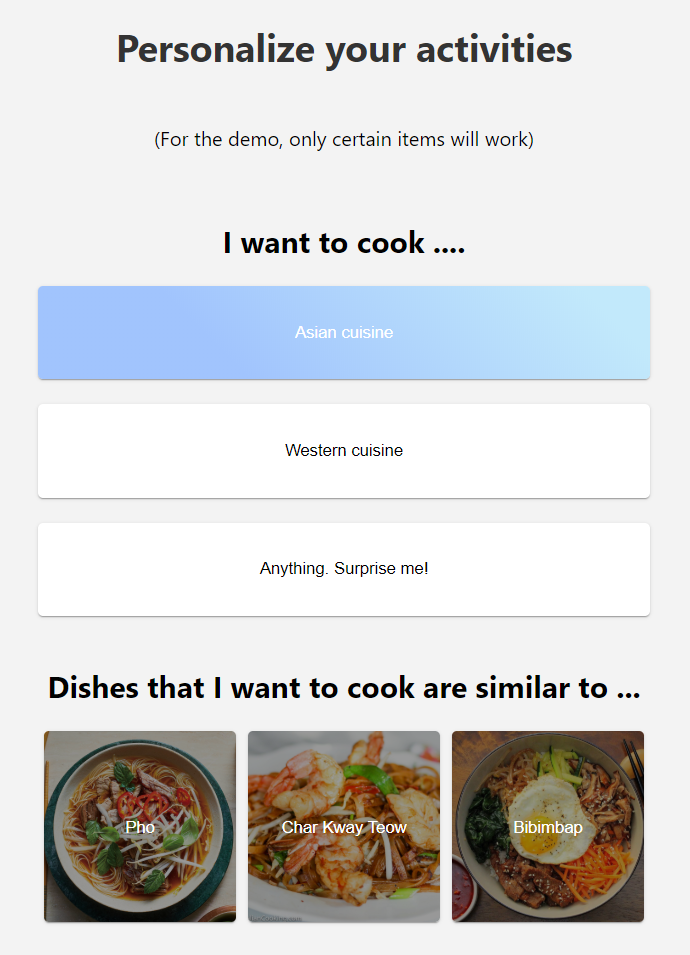
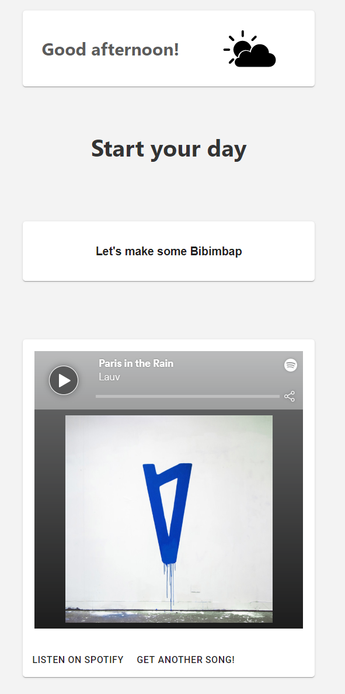

# Breaking Good

Try the app here: https://code-for-corona-tanhaus.herokuapp.com/entry

Presentation pitch: https://youtu.be/sSDSqQGcsE8

Pitch deck: https://docs.google.com/presentation/d/1dDtVuqwZV6yUSI2Ur-JeBxQ_RDuK3naedg7c5lVeJqM/edit?usp=sharing

This is TanHaus's submission to Code for Corona Hackathon 2020 (https://codeforcorona.devpost.com/)

Devpost project: https://devpost.com/software/cb-activity-suggestion-app

## Inspiration
Without proper planning and motivation, we often fall victim to the never-ending Netflix binges. The team thus want to make an app that can help motivate us to do more meaningful activities, e.g. make a donation and learn to cook a new dish, during this period.

## What it does
A one-stop destination for meaningful and personalized activities to do during CB → Users can find activities to do with ease.

An extensive database of tailored activities → Users are recommended with interesting and engaging activities.

Visually engaging UI/UX → Users can have an enjoyable experience.

## Screenshots

## How we built it

We use Facebook's Create React App (https://github.com/facebook/create-react-app) to initialize the project.

For deployment, we deploy the app to Heroku using Heroku Buildpack for create-react-app (https://github.com/mars/create-react-app-buildpack)

## Installation
- Clone the repo
- Install dependencies `npm install`
- Run local server `npm start`
- Navigate to `localhost:3000/entry`

## What's next for CB activity suggestion app
- Make a recommendation system
- Build a larger database

